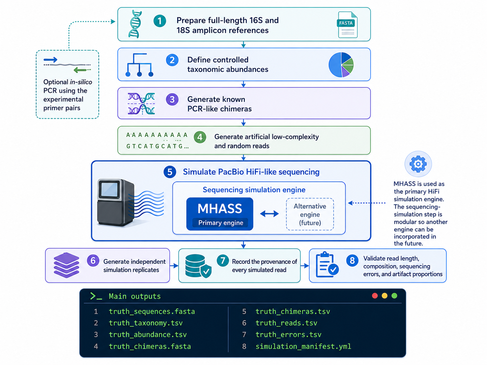

# PacBio HiFi Amplicon Simulation

A reproducible Nextflow workflow for generating synthetic full-length 16S and 18S rRNA amplicon datasets with known ground truth for bioinformatics benchmarking.

The workflow is designed to generate PacBio HiFi-like reads from controlled microbial communities while retaining complete knowledge of the expected sequences, taxonomy, abundances, sequencing errors, PCR-like chimeras, and artificial low-complexity/random reads.

## Purpose

The simulated datasets are intended for benchmarking amplicon-processing pipelines under controlled conditions where the expected result is known.



The workflow:

* prepares full-length 16S and 18S amplicon references;
* optionally performs in-silico PCR using the experimental primer pairs;
* defines controlled taxonomic abundances;
* generates known PCR-like chimeras;
* generates artificial low-complexity and random reads;
* simulates PacBio HiFi-like sequencing using MHASS;
* generates independent simulation replicates;
* records the provenance of every simulated read;
* validates read length, composition, sequencing errors, and artifact proportions.

MHASS is used as the primary HiFi simulation engine. The workflow architecture keeps the sequencing-simulation step modular so that another engine can be incorporated in the future.

## Main outputs

```text
truth_sequences.fasta
truth_taxonomy.tsv
truth_abundance.tsv
truth_chimeras.fasta
truth_chimeras.tsv
truth_reads.tsv
truth_errors.tsv
simulation_manifest.yml

16S_sim_01.fastq.gz
16S_sim_02.fastq.gz
16S_sim_03.fastq.gz

18S_sim_01.fastq.gz
18S_sim_02.fastq.gz
18S_sim_03.fastq.gz
```

## Run the workflow

16S:

```bash
nextflow run main.nf \
    -profile docker \
    --params-file params/16S.yml
```

18S:

```bash
nextflow run main.nf \
    -profile docker \
    --params-file params/18S.yml
```

For an HPC environment using Apptainer:

```bash
nextflow run main.nf \
    -profile apptainer \
    --params-file params/16S.yml
```

## Reproducibility

All simulation parameters, reference accessions, primer sequences, software versions, random seeds, artifact proportions, and simulation-engine metadata are recorded in `simulation_manifest.yml`.

The simulated FASTQ files represent **PacBio HiFi-like data** and are not intended to reproduce the PacBio Revio SPRQ-Nx error model exactly.

